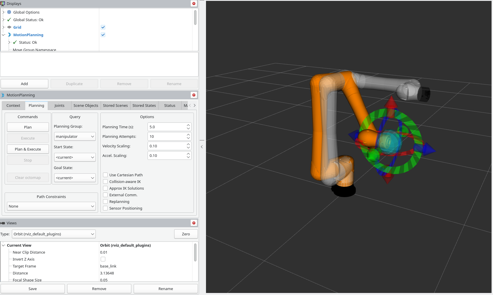

# CRX_moveit_config

This folder contains all the packages to allow commanding the robots from moveit and the remote pc.

To test this with mock robots copy this into your terminal

```console
ros2 launch fanuc_control robot_bringup.launch.py robot_type:=crx10ia_l use_mock_hardware:=true
```

<p align="center">

</p>
